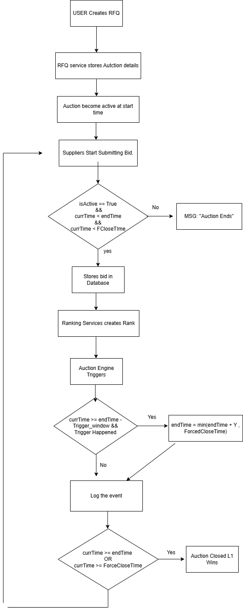
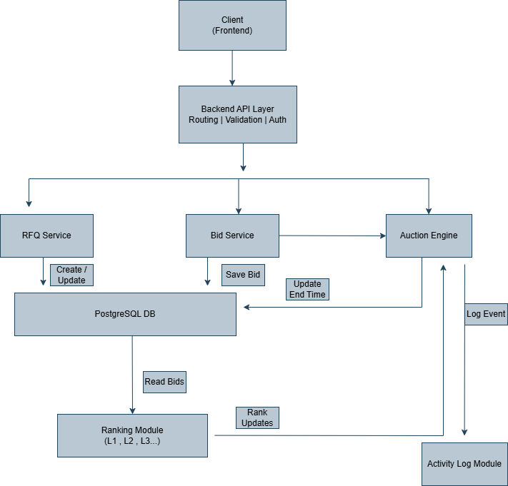
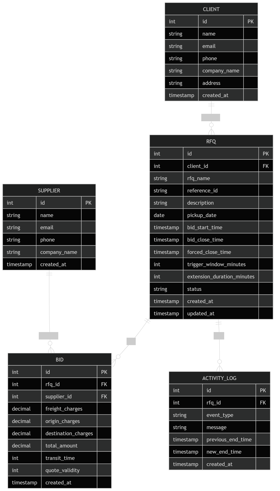

# TrueBid - RFQ Auction System

## Problem Statement
Companies want to get the best logistics price from multiple suppliers.
Traditional systems lack transparency and allow last-minute manipulation.

---

## Solution
TrueBid implements a dynamic RFQ-based auction system where suppliers compete by placing bids, and the system extends auction time based on activity.

---

##  Functional Requirements
- RFQ Creation
- Bid Submission
- Auction Extension Logic
- Ranking System (L1, L2, L3)
- Forced Close Handling
- Activity Logging
- Reliability

## Workflow

 - Tool used for flow diagram - draw.io

## High Level Design
The system follows a modular monolithic architecture where the frontend communicates with backend APIs. The backend is logically divided into services to handle different responsibilities.

### Key Components
- RFQ Service: Manages creation of RFQs and stores auction configuration.
- Bid Service: Accepts and validates supplier bids.
- Auction Engine: Handles core auction logic including trigger conditions and time extension.
- Ranking Module: Calculates bid rankings (L1, L2, etc.) based on price.
- Database: Stores RFQs, bids, and activity logs.

### Flow Summary
When a bid is placed, it is validated and stored, rankings are updated, and the auction engine checks whether the auction should be extended based on defined conditions.


 - Tool use for making HLD diagram - draw.io

# Database Schema – TrueBid RFQ Auction System

This system models a **British Auction-based RFQ (Request for Quotation)** process where clients create RFQs and suppliers submit competitive bids. The database is designed using a relational model with **RFQ as the central entity**, ensuring structured data storage, consistency, and auditability.

---

## ER Diagram


 - Tool used for making Schema Diagram - mermaid live editor

---

## Tables & Schema Details

---

### 1. Client

Stores information about buyers who create RFQs.

**Fields:**
- `id` (Primary Key)
- `name`
- `email` (Unique)
- `phone`
- `company_name`
- `address`
- `created_at`

**Constraints:**
- `email` must be unique

---

### 2. Supplier

Stores details of suppliers participating in auctions.

**Fields:**
- `id` (Primary Key)
- `name`
- `email` (Unique)
- `phone`
- `company_name`
- `created_at`

**Constraints:**
- `email` must be unique

---

### 3. RFQ (Request for Quotation)

Represents an auction along with its configuration and requirements.

**Fields:**
- `id` (Primary Key)
- `client_id` (Foreign Key → Client, NOT NULL)
- `rfq_name`
- `reference_id` (Unique)
- `description`
- `pickup_date`
- `bid_start_time` (NOT NULL)
- `bid_close_time` (NOT NULL)
- `forced_close_time` (NOT NULL)
- `trigger_window_minutes`
- `extension_duration_minutes`
- `status` (ENUM: ACTIVE, CLOSED, FORCE_CLOSED)
- `created_at`
- `updated_at`


### 4. Bid

Represents a supplier’s quotation for an RFQ.

**Fields:**
- `id` (Primary Key)
- `rfq_id` (Foreign Key → RFQ, NOT NULL)
- `supplier_id` (Foreign Key → Supplier, NOT NULL)
- `freight_charges`
- `origin_charges`
- `destination_charges`
- `total_amount`
- `transit_time` (in days)
- `quote_validity` (in days)
- `created_at`

---

### 5. ActivityLog

Stores all auction-related events for transparency and auditability.

**Fields:**
- `id` (Primary Key)
- `rfq_id` (Foreign Key → RFQ)
- `event_type` (ENUM: BID_PLACED, EXTENSION, AUCTION_CLOSED)
- `message`
- `previous_end_time`
- `new_end_time`
- `created_at`


---

##  Relationships 

- One **Client** can create multiple **RFQs**
- One **RFQ** can have multiple **Bids**
- One **Supplier** can submit multiple **Bids**
- One **RFQ** can have multiple **Activity Logs**

---

---

## Auction Logic (Core Feature)

The system implements a **British Auction with dynamic time extensions**.

### Key Rules:

1. **Trigger Window (X minutes)**  
   - If a bid is placed within the last X minutes before closing, extension may occur.

2. **Extension Duration (Y minutes)**  
   - Auction extends by Y minutes when triggered.

3. **Extension Triggers**
   - Bid placed in trigger window  
   - Any supplier rank change  
   - Lowest bidder (L1) change  

4. **Forced Close Rule**
   - Auction will never extend beyond `forced_close_time`

---

### Example

- Close Time: 6:00 PM  
- Trigger Window: 10 minutes  
- Extension Duration: 5 minutes  

If a bid is placed at 5:55 PM →  
Auction extends to 6:05 PM  

---

## API Endpoints

### RFQ APIs
- `POST /api/rfqs` → Create RFQ  
- `GET /api/rfqs` → Get all RFQs  
- `GET /api/rfqs/:id` → Get RFQ details  
- `GET /api/rfqs/:id/logs` → Get activity logs  

### Bid APIs
- `POST /api/bids` → Place bid  
- `GET /api/bids/rfq/:rfqId` → Get leaderboard  

---

## Frontend Features

- Landing page with system overview  
- RFQ listing with live auction status  
- RFQ detail page:
  - Leaderboard (L1, L2, L3 ranking)  
  - Bid submission form  
  - Activity logs (bid + extension history)  
  - Auto-refresh every 5 seconds  
  - Live indicator and last updated timestamp  

---

##  Tech Stack

### Frontend
- React (Vite)
- Tailwind CSS  

### Backend
- Node.js
- Express.js  

### Database
- PostgreSQL (Neon)

---

## ⚙️ Setup Instructions

### Backend
```bash
cd backend
npm install
npm start

### Frontend
```bash
cd frontend
npm install
npm run dev
