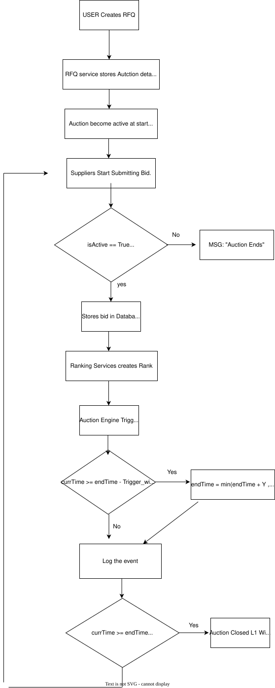

# TrueBid - RFQ Auction System

## Problem Statement
Companies want to get the best logistics price from multiple suppliers.
Traditional systems lack transparency and allow last-minute manipulation.

---

## Solution
TrueBid implements a dynamic RFQ-based auction system where suppliers compete by placing bids, and the system extends auction time based on activity.

---

##  Functional Requirements
- RFQ Creation
- Bid Submission
- Auction Extension Logic
- Ranking System (L1, L2, L3)
- Forced Close Handling
- Activity Logging
- Reliability

## Workflow

